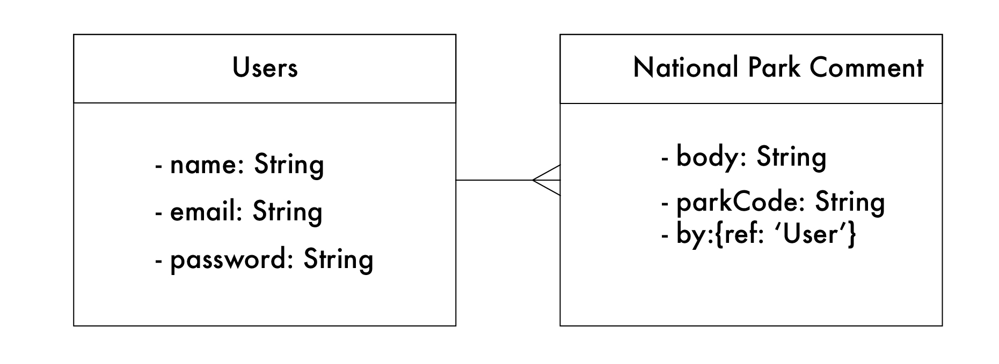

# Pocket Parks

--
### Brief Description

A pocket parks app where you can browse all the National Parks informations and add your comments.

**MVP:**
Basic CRUD app

**Dream future:**
* Users can edit and delete their own comments.
* Using google map to show the parks in the map.
 

--
###Explanation of Technologies Used

**Backend:**

* Node.js
* **Packages:** Express, Mongoose, EJS Layouts, Bcrypt, body-parser, MongoDB, dotenv, morgan, axios, jwt.

**Front-End:** 

* Racet framework
* JavaScript
* HTML
* jQuery
* Bootstrap
* National Park API

### Pocket Parks ERD

### Pocket Parks Wireframe

![Screenshot of Wireframe] (./readme_img/PocketParks_wireframe.jpg)

